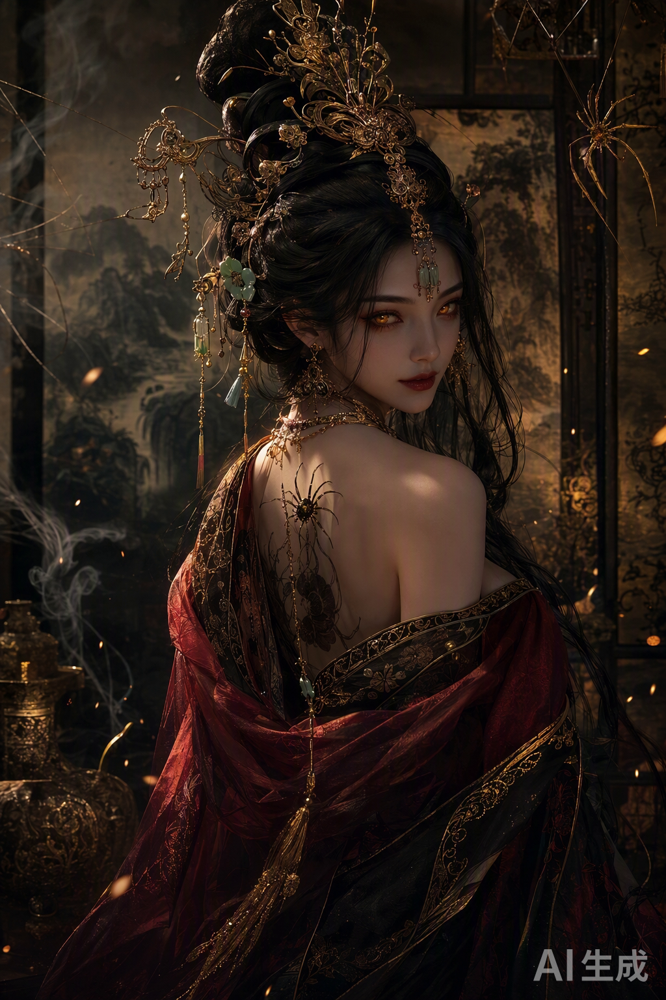
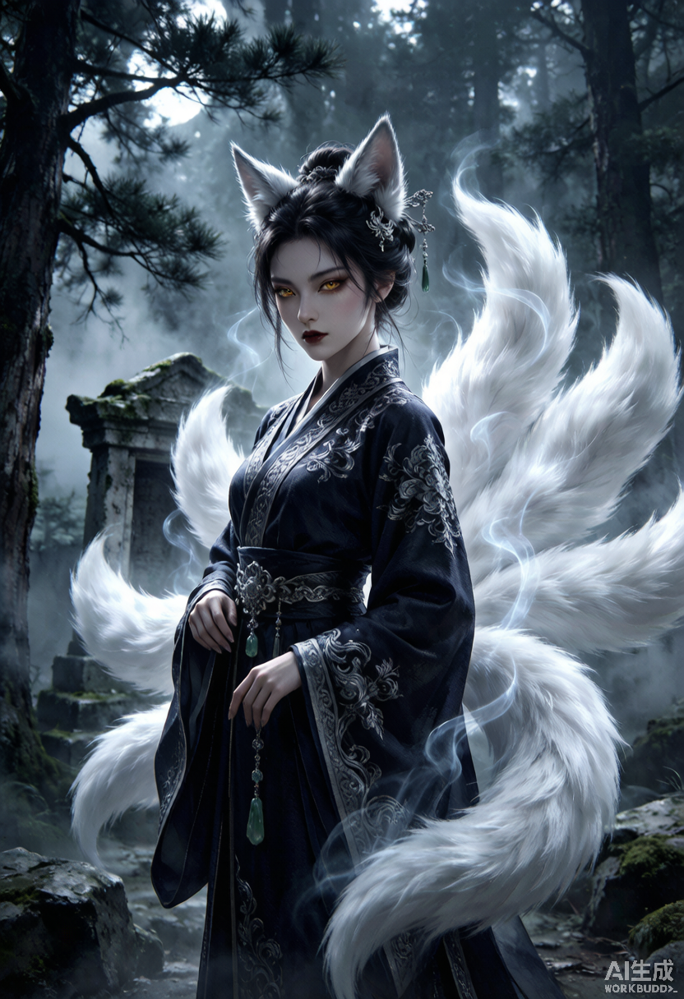
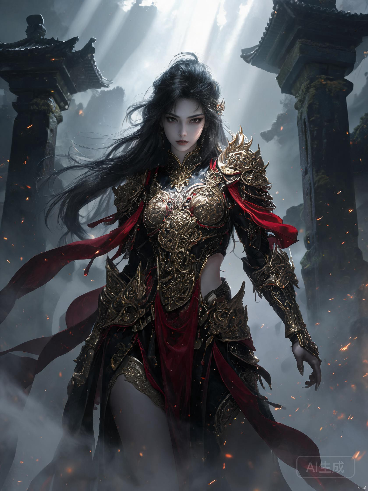
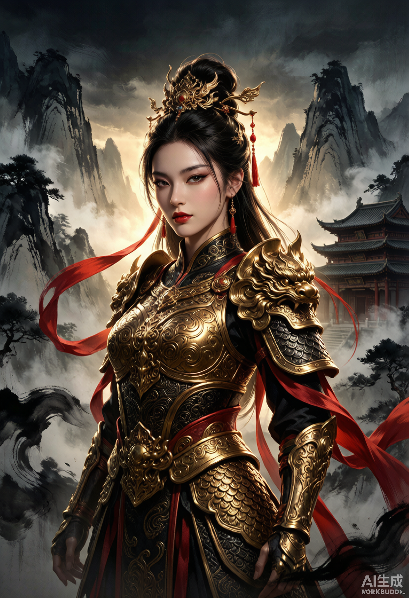

# “黑悟空风格性感美女”不同 Agent / 模型成图对比报告

> 评测日期：2026-08-09  
> 原始目录：`原始素材目录（网络盘）`  
> 样本：5 张独立成图 + 1 张由 Qwen 原图制作的成品展示页

## 一、结论先行

### 综合排名

| 排名 | 文件标签 | 综合分 | 一句话评价 |
|---:|---|---:|---|
| 1 | ChatGPT | **90.1** | 最像可直接进入写实动作 RPG 宣传物料的成图，人体、材质、空间和交付完整性最稳 |
| 2 | Qwen3.8-Max | **88.0** | 最准确抓住“性感妖女”，蜘蛛精叙事鲜明、冲击力强；水印和规避手部拉低综合分 |
| 3 | wb-KimiK3 | **85.5** | 九尾狐概念最有记忆点，冷色氛围优秀；与“悟空/黑神话”的直接关联和性感度稍弱 |
| 4 | Trae-Seedream | **80.0** | 最有全身战斗英雄海报感，分辨率最高；更像通用玄幻 MMO，手部和盔甲结构问题明显 |
| 5 | wb-Hy3 | **79.0** | 国潮水墨和金甲完成度不错；气质偏明亮、端庄、静态，离黑神话的阴郁写实感较远 |

这不是“模型绝对能力榜”。每个组合只有一张图，随机种子、Agent 改写提示词、图片后端、审核策略和平台水印都可能影响结果。本报告评的是这 5 次具体的 **Agent + 大模型 + 图片生成后端** 的端到端输出。

### 不同目标下的冠军

| 目标 | 最佳样本 | 理由 |
|---|---|---|
| 综合可用性 | ChatGPT | 无水印、人体稳定、材质可信、背景与人物融合自然 |
| 性感与第一眼吸引力 | Qwen3.8-Max | 回眸、裸肩、红黑金配色和蜘蛛精设定与提示最直接 |
| 黑暗中式动作 RPG 电影感 | ChatGPT | 古寺、石兽、兵器、旧金属和冷暖光最像真实游戏过场 |
| 妖怪概念与原创记忆点 | wb-KimiK3 | 九尾构图形成独特轮廓，人物与环境有完整物种叙事 |
| 全身英雄海报 | Trae-Seedream | 正面站姿、披帛、重甲和天光具有强烈角色卡/宣传图结构 |
| 中国传统视觉元素 | wb-Hy3 | 水墨山、宫阁、金甲和红缨的国潮识别度最高 |
| Agent 后期包装 | Qwen3.8-Max 成品图 | 唯一提供完整横版展示页，标题、卖点、参数和视觉系统齐全 |

## 二、评分口径

将原始目标理解为：**清晰成年的东方女性角色；具有性感或成熟魅力；有黑暗中国神话、妖怪或动作 RPG 气质；画面精致、可信、有游戏电影感。**

“性感”不简单等于裸露。姿态、眼神、剪裁、轮廓、妆容和镜头语言同样计入。评分时不会因为衣服更多就自动扣高分，但若对“性感美女”的表达明显保守，会在提示词遵循度中扣分。

| 维度 | 权重 | 主要考虑 |
|---|---:|---|
| 提示词核心遵循 | 15 | 成年美女、性感/成熟魅力、单一主体、东方奇幻主题是否明确 |
| 黑悟空式风格贴合 | 15 | 黑暗神话、古旧质感、妖气、危险感、写实游戏电影感 |
| 构图与视觉冲击 | 15 | 主次层级、轮廓、视线引导、裁切、姿态、第一眼吸引力 |
| 人物审美与表情 | 10 | 面部自然度、辨识度、眼神、气质与角色性格 |
| 人体与结构正确性 | 12 | 手指、手臂、肩颈、躯干、兵器与服装结构是否可信 |
| 材质与细节一致性 | 12 | 金属、织物、皮肤、头发、毛发、饰品细节是否清楚且讲得通 |
| 光影、色彩与空间 | 8 | 光源逻辑、冷暖、景深、空气感、人物与环境融合 |
| 原创性与叙事 | 5 | 是否有角色故事、妖怪身份或独特视觉母题 |
| 技术交付性 | 8 | 分辨率、压缩、可裁切性、水印、是否能直接投入设计 |

## 三、逐项得分

| 样本 | 提示 15 | 风格 15 | 构图 15 | 人物 10 | 人体 12 | 细节 12 | 光影 8 | 原创 5 | 交付 8 | 总分 |
|---|---:|---:|---:|---:|---:|---:|---:|---:|---:|---:|
| ChatGPT | 12.5 | 14.0 | 14.0 | 9.2 | 11.0 | 11.2 | 7.2 | 3.5 | 7.5 | **90.1** |
| Qwen3.8-Max | 14.5 | 13.5 | 13.5 | 9.2 | 9.5 | 11.0 | 7.3 | 4.5 | 5.0 | **88.0** |
| wb-KimiK3 | 12.5 | 12.5 | 13.5 | 8.8 | 10.5 | 10.5 | 7.4 | 4.6 | 5.2 | **85.5** |
| Trae-Seedream | 13.5 | 11.5 | 13.0 | 8.5 | 8.5 | 10.5 | 7.2 | 3.4 | 3.9 | **80.0** |
| wb-Hy3 | 11.5 | 10.0 | 12.5 | 9.0 | 10.0 | 10.0 | 6.8 | 3.5 | 5.7 | **79.0** |

### 纯视觉排名

去掉水印、文件格式和分辨率等“技术交付”因素，把其余 92 分归一化为 100 分后：

| 排名 | 样本 | 纯视觉分 |
|---:|---|---:|
| 1 | Qwen3.8-Max | **90.2** |
| 2 | ChatGPT | **89.8** |
| 3 | wb-KimiK3 | **87.3** |
| 4 | Trae-Seedream | **82.7** |
| 5 | wb-Hy3 | **79.7** |

Qwen 与 ChatGPT 的纯视觉差距只有 0.4 分，属于同一梯队：Qwen 赢在主题表达和创意冲击，ChatGPT 赢在结构稳定与真实质感。加入交付性后，ChatGPT 因无可见水印而反超。

## 四、逐图详细评价

### 1. ChatGPT — 综合第一，最像真实游戏资产

优点：

- 古寺、石兽、烟雾、火星和兵器共同建立了完整场景，不只是“美女加背景”。
- 黑、暗红、旧金三色控制克制；盔甲、锦缎、头发和皮肤的材质区分最自然。
- 侧身三分之四构图让面部、胸甲、腰甲和持剑手形成稳定的视觉路径。
- 可见手部握剑关系合理，肩颈、腰胯和重甲的受力关系在五张中最可信。
- 面部有真实皮肤和成熟气质，没有明显的二次元大眼或蜡像感。
- 没有可见平台水印，最容易直接用于提案、裁切和二次排版。

扣分理由：

- 对“性感”的处理最保守，更多是英气、贵气和成熟魅力；若把“性感”视为第一优先级，会明显落后 Qwen。
- 角色更像人类女将，缺少蜘蛛、狐尾、角、妖纹等一眼可见的妖怪母题，原创叙事偏安全。
- 整体平均亮度仅约 11.9%，暗部裁切约 6.29%；大屏观看很有电影感，但手机缩略图可能丢失黑甲细节。
- 下方兵器被画幅裁断，作为完整角色设定图不如 Seedream 方便。

适合：游戏人物主视觉、影视概念图、品牌提案、需要后期继续加工的无水印底图。

### 2. Qwen3.8-Max — 纯视觉第一，最懂“性感妖女”

优点：

- 回眸姿态、裸肩、湿发感、红唇、琥珀眼与红黑薄纱，对“性感美女”的响应最直接。
- 蜘蛛、蛛网、肩部蛛纹和繁复垂饰形成统一的“蜘蛛精”叙事，不需要文字也能理解角色身份。
- 暖金逆光、深黑背景和红色衣料形成强烈明暗与冷暖焦点，社交媒体缩略图冲击力最好。
- 饱和度均值约 46.2%，为五张最高；华丽、危险、诱惑的气质最鲜明。
- 细节密度高但主要集中在头冠、面部和肩背，视线仍能落在眼睛上，没有完全失控。

扣分理由：

- 双手完全不入镜，回避了生成中最困难的人体部位；因此不能仅凭这张图证明其人体能力优于 ChatGPT 或 Kimi。
- 皮肤偏瓷娃娃，毛孔和微表情弱；耳朵接近精灵耳，容易从中国妖怪滑向通用奇幻审美。
- 头冠、蛛丝、发丝和金属链局部互相粘连，结构上“很好看但未必能制作出来”。
- 大面积灰色“AI生成”水印直接降低商业交付性；若能导出无水印版本，综合分有望提高约 2–3 分。
- 性感表达很强，但战斗性较弱，更像妖妃肖像而不是动作 RPG 可操控角色。

适合：妖怪设定封面、社交媒体吸睛图、角色故事卡、偏魅惑的反派或 Boss 概念。

### 3. wb-KimiK3 — 创意身份最明确，冷色氛围最佳

优点：

- 狐耳、金瞳、九尾、黑银汉服和森林遗迹形成完整物种与环境叙事，原创记忆点最强。
- 白色狐尾绕人物形成天然视觉框架，既增强轮廓，又制造前后景和运动感。
- 冷蓝月光、薄雾、青苔和银线刺绣协调统一，气氛安静、危险、神秘。
- 两只手都出现，手指和袖口关系总体可信；人体没有 Seedream 那样明显的结构错误。
- 高亮毛发与深色服装形成强对比，缩略图识别度好。

扣分理由：

- “九尾狐”更容易让人想到通用东亚狐妖或日式 kitsune，和“悟空”或《黑神话》世界的直接关联不如 ChatGPT。
- 性感主要来自眼神和身段，服装较保守；若严格按“性感美女”排序，会落后 Qwen 和 Seedream。
- 狐尾数量难以清点，部分尾巴在腰背处相互融合，毛发与烟雾边界有生成式过渡。
- 白尾占据面积过大，亮度容易压过面部；高光裁切约 1.13%，为五张最高。
- 832 × 1216，仅约 1.01MP，同时带有右下角水印，二次裁切余量有限。

适合：狐妖角色设定、冷色奇幻海报、需要强轮廓和种族辨识度的概念图。

### 4. Trae-Seedream — 英雄气势强，但结构错误最明显

优点：

- 是五张中最完整的全身战斗角色展示，能清楚看见肩甲、胸甲、腰甲、腿甲和披帛。
- 正面站姿、峡谷石柱、顶光和飞散火星具有标准的游戏英雄登场气势。
- 1680 × 2240、约 3.76MP，为原始成图中像素数最高，构图也最适合做竖版人物卡。
- 黑金重甲与红色披帛对主题响应直接，性感主要由贴身盔甲、腰部开口和长腿承担。

扣分理由：

- 视觉语言更像玄幻 MMO、手游角色卡或二次元写实插画，缺少《黑神话》式的古旧、粗粝和现实质感。
- 右侧手掌与手指明显拉长、尖化；另一侧手臂被披帛和盔甲遮挡，人体可信度最低。
- 胸甲、腰甲和腹甲装饰相互挤压，很多纹样是“连续漂亮噪声”，没有清晰铆接、分片和活动逻辑。
- 面部过白、眼睛偏动漫化，与写实环境和重甲的材质语言不完全一致。
- 文件虽然像素最多，但 JPEG 只有约 0.44MiB、约 0.97 bits/pixel，压缩很重；放大后细密纹样更容易糊成块。
- 右下角存在较大的“AI生成”水印。

适合：玄幻手游角色卡、全身站姿海报、需要强势女战士而非妖女肖像的场景。

### 5. wb-Hy3 — 国潮审美成熟，但偏离黑暗神话

优点：

- 水墨山、云海、宫阁、金甲、红缨和发冠具有强烈中国传统视觉识别度。
- 人物轮廓清楚，金甲对称性较好；脸部妆容成熟、端庄，完成度稳定。
- 明亮背光和红色飘带让画面比 ChatGPT/Qwen 更容易在普通屏幕上看清。
- 双手均出现，虽有小瑕疵，但没有 Seedream 那种显著畸形。

扣分理由：

- 整体更像国潮女将、三国题材手游或仙侠宣传画，而不是阴郁、危险、写实的黑暗神话。
- 金甲过度光滑、饱和，缺少氧化、磨损、灰尘、织物纤维等“真实使用过”的证据。
- 人物姿态较静，面部是常见的精修 AI 美女模板，角色性格和故事弱于 Qwen/Kimi。
- 水墨背景与写实金甲像两种视觉体系叠在一起，光照融合不如 ChatGPT。
- 边缘能量指标约 45.81，为五张最高，说明轮廓和纹样非常锐；这带来“清晰”观感，也可能显得过度锐化、缺少空气透视。
- 832 × 1216 且带水印，交付余量有限。

适合：国潮海报、历史幻想女将、偏明亮端庄的中文市场宣传图。

## 五、Qwen 成品展示页的单独评价

这张图使用了同一张 Qwen 原图，属于后期排版结果，不应当作为第六个模型样本重复计分。

### 排版评分：86 / 100

| 维度 | 得分 | 评价 |
|---|---:|---|
| 信息层级 | 18 / 20 | 左图右文、标题最大、标签和参数逐级降低，阅读顺序清楚 |
| 字体与中文排版 | 17 / 20 | “蜘蛛精 · 媚骨天成”有角色卡气质；正文略小且偏灰 |
| 视觉系统一致性 | 18 / 20 | 黑金、细网格、描边卡框与原图配色一致，整体高级 |
| 内容表达 | 17 / 20 | 角色名、描述、关键词和规格完整；部分文案略像模板化营销语 |
| 实际交付 | 16 / 20 | 2289 × 1275 横版适合展示，但原图水印仍在，底部文字对比度偏低 |

它说明 Qwen 这条 Agent 流程不只完成了“生成图片”，还主动做了命名、文案和作品集式包装。在比较 Agent 的端到端完成意识时，这是明显加分项；但由于其他 Agent 没有同等排版任务，不能据此断言 Qwen 的大模型本身画质更强。

## 六、客观图像统计及解释

以下数据只用于解释观感，不直接决定审美分数。亮度、饱和度、边缘能量和信息熵更高，并不自动代表质量更好。

| 样本 | 尺寸 | MP | 平均亮度 | 明暗跨度 P95-P5 | 平均饱和度 | 边缘能量 | 信息熵 | 暗部裁切 | 高光裁切 |
|---|---:|---:|---:|---:|---:|---:|---:|---:|---:|
| ChatGPT | 1024×1536 | 1.57 | 11.9 | 24.5 | 32.7 | 22.57 | 6.21 | 6.29% | 0.00% |
| Qwen3.8-Max | 1024×1536 | 1.57 | 12.4 | 31.6 | 46.2 | 27.21 | 6.33 | 6.86% | 0.01% |
| Trae-Seedream | 1680×2240 | 3.76 | 29.4 | 74.8 | 22.4 | 23.12 | 7.47 | 0.51% | 0.15% |
| wb-Hy3 | 832×1216 | 1.01 | 27.9 | 78.1 | 33.9 | 45.81 | 7.51 | 4.17% | 0.29% |
| wb-KimiK3 | 832×1216 | 1.01 | 33.4 | 83.5 | 34.2 | 35.70 | 7.71 | 5.73% | 1.13% |

关键解读：

- ChatGPT 与 Qwen 是明显的低调暗光方案，平均亮度仅约 12%；电影感强，但需要注意移动端暗部。
- Qwen 的饱和度最高，说明红、金、琥珀等色彩更浓，也是它第一眼最“艳”的原因。
- Hy3 的边缘能量最高，和金甲纹样、山石笔触的高锐度相符；锐利不等于真实，过强时会削弱空气感。
- Kimi 的明暗跨度和高光裁切最高，主要来自白狐尾；戏剧性最好，但尾巴容易抢主角。
- Seedream 的分辨率最高，但 JPEG 压缩比远高于其他 PNG；“像素多”不等于细节一定最可用。

## 七、如果要继续优化，每张图最值得做的一件事

| 样本 | 优先优化项 | 预期收益 |
|---|---|---|
| ChatGPT | 在不增加裸露的前提下强化妖怪特征与姿态魅力 | 保留高可信度，同时补足“性感妖女”和原创身份 |
| Qwen3.8-Max | 生成包含双手的中景或全身无水印版 | 验证人体能力并显著提高交付分 |
| wb-KimiK3 | 减少一部分前景狐尾并加强中国妖怪细节 | 让脸部成为第一焦点，降低通用 kitsune 感 |
| Trae-Seedream | 重绘双手并简化胸腹盔甲纹样 | 结构可信度和真实游戏资产感会明显提升 |
| wb-Hy3 | 压低金甲亮度，加入磨损、烟尘和冷暗环境 | 从国潮仙侠海报向黑暗神话靠拢 |

## 八、最终判断

如果只能选一张继续做正式项目，建议选 **ChatGPT**：它最稳定、最可信、最容易进入后期流程。

如果目标是“让人第一眼就觉得性感、妖异、想点开”，建议选 **Qwen3.8-Max**：它对题意的情绪理解最好，但应先解决水印并补测手部/全身。

如果要做系列角色而不是单张美女图，**Kimi** 的方向最值得扩展，因为它已经建立了明确种族轮廓和环境语言。Seedream 与 Hy3 都有成熟商业风格，但需要分别修正“通用 MMO 感”和“国潮仙侠感”，才能更接近黑暗神话题目。

## 九、评测限制

- 每个 Agent/模型只有一个独立样本，无法排除随机种子带来的偶然性。
- 文件名只能作为标签，不能单独证明背后的确切模型版本或图像后端。
- Agent 可能对同一用户提示词进行了不同程度的扩写；因此结果同时反映 Agent 的提示词工程能力，而不是纯图像模型能力。
- 没有保存生成耗时、重试次数、审核拦截和成本数据，本报告不能比较速度或价格。
- 平台水印属于端到端交付体验的一部分，但不应简单归因于底层模型画质。
- 更严谨的模型结论需要每组至少 4 张、固定尺寸和图片后端、匿名乱序评分，并报告均值与方差。
